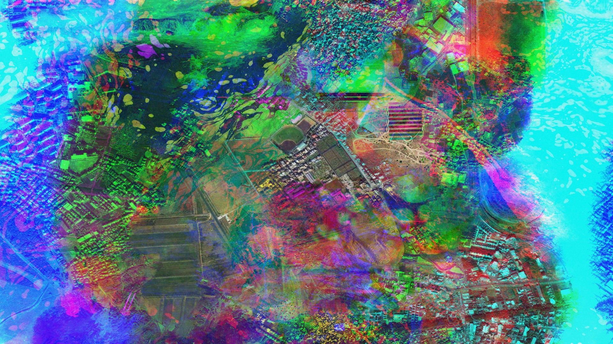
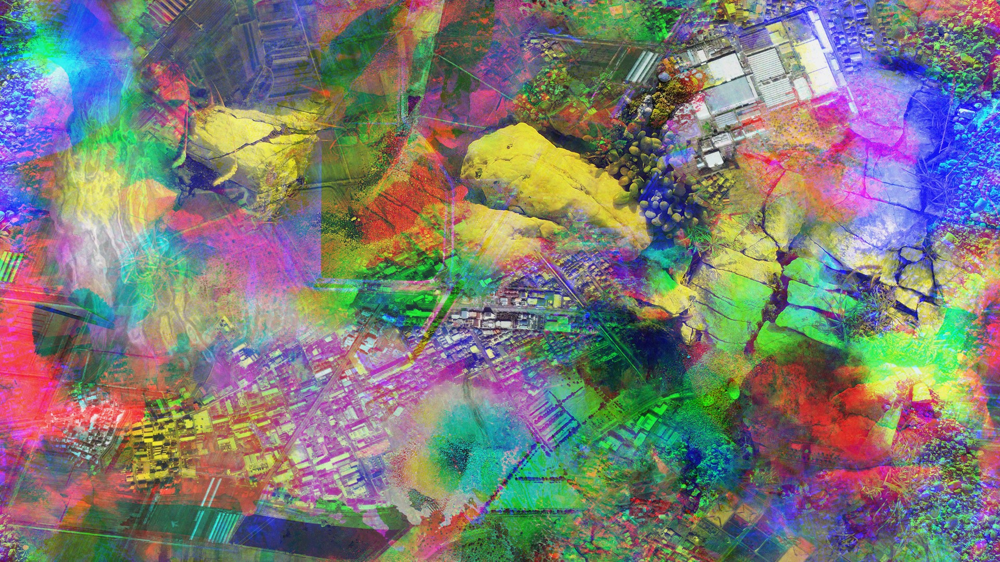
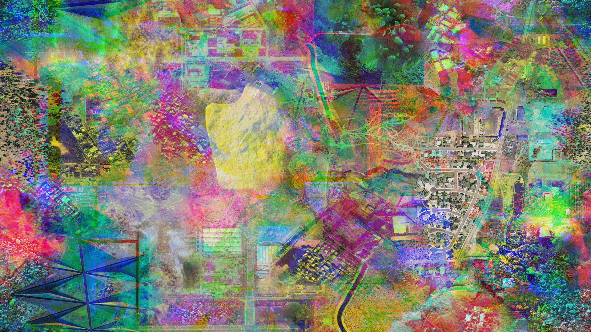
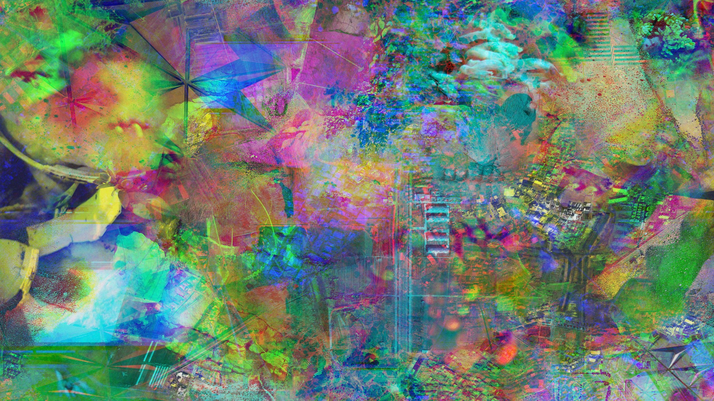

Experiments to create a slowly changing visual collage, the code that led to [Obscure Ecologies](/posts/projects/obscure_ecologies).
Satellite imagery from Mapquest, close-ups from my own. Built with [Processing 3](http://www.processing.org)

