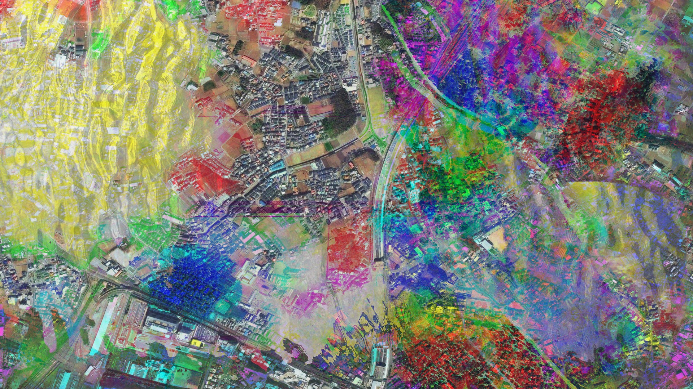

Experiments to create a slowly changing visual collage, the code that became [Obscure Ecologies](/posts/projects/obscure_ecologies).
Satellite imagery from Mapquest, close-ups own photos. Built with [Processing](http://www.processing.org)

