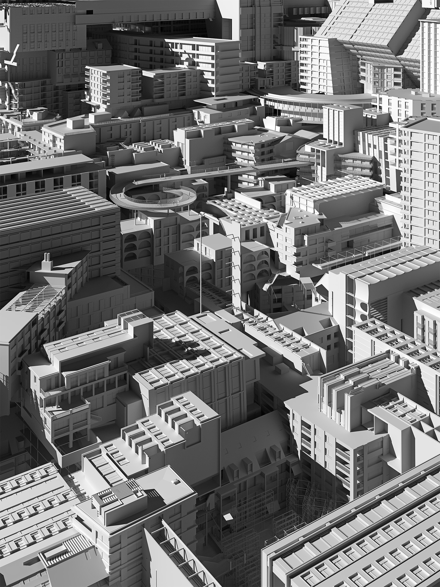
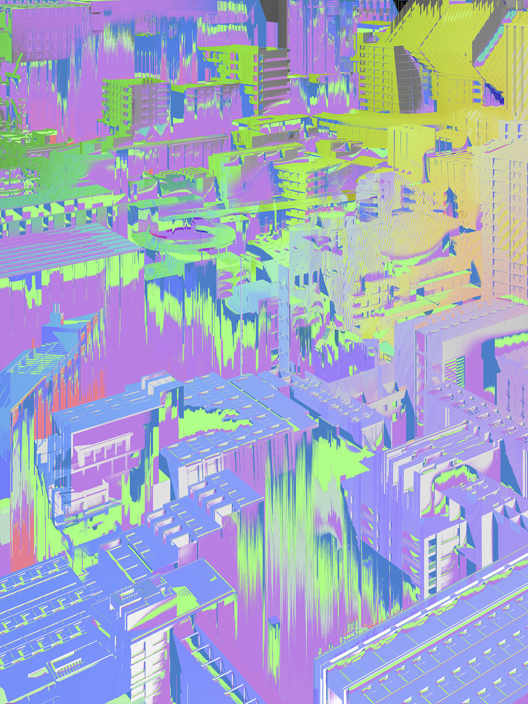
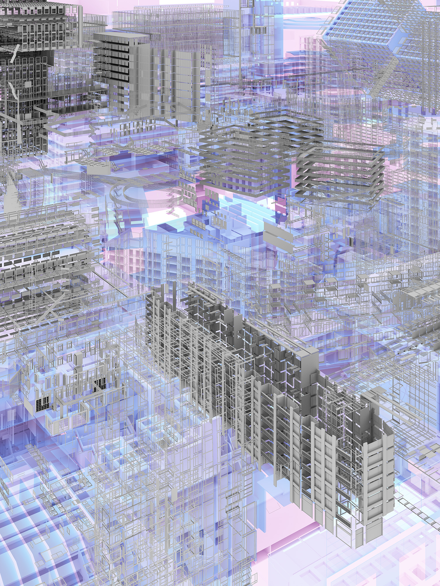
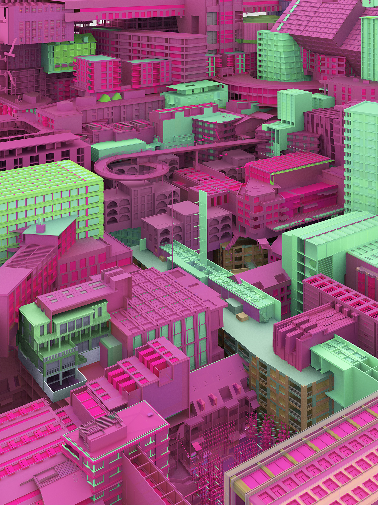
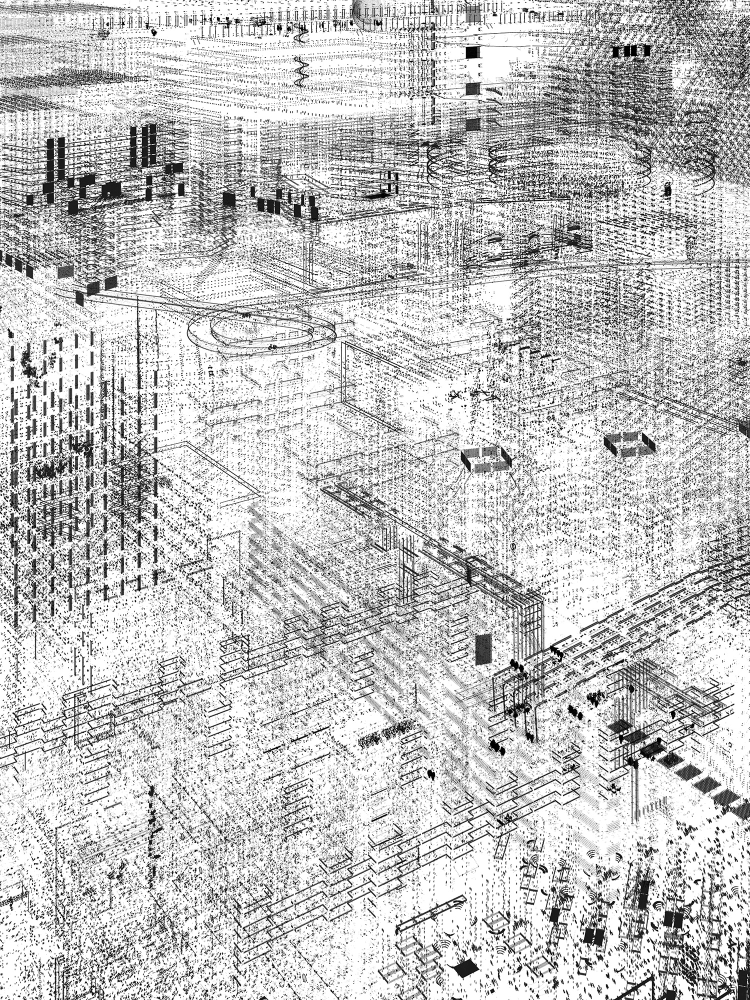

Exhibited in [Photobastei](http://www.photobastei.ch/) in September 2018.

**Relics** consists of a set of images are based on a small set salvaged from a temporary storage of 3d models of architectural rendering. The models – built and used for architectural projects earlier in 2017 – are discarded by-products of an all digital production process. Taken out of context and stripped of their characteristic materials, the projects are cast in homogeneity, questioning the way architecture is visually represented on many platforms from local competitions to entertainment industry.

The same data is used to produce the five images, by re-articulating and combining different elements in the the digital image production process, from multi-dimensional position data to color and pixel values. The following set of digital operations were performed on the data:

### Relics (shadow / light)
_Rendering the whole dataset using a global and a point light source._

### Relics (sorted maps)
_Superimposing and distorting the data layers (position, depth, surface orientation) by rearranging and sorting pixels based on color and brightness values._

### Relics (windows/walls/floors)
_Extracting and overlaying objects based on keywords of architectural elements: “frame”, “glass”, “wall”,”floor”._

### Relics (lexicographical order)
_Mapping first three characters in object names to color values of materials (red, green, blue)._

### Relics (point clouds)
_Selectively extracting coordinates of object vertices and using points and lines of different sizes to represent them in two dimensions._

